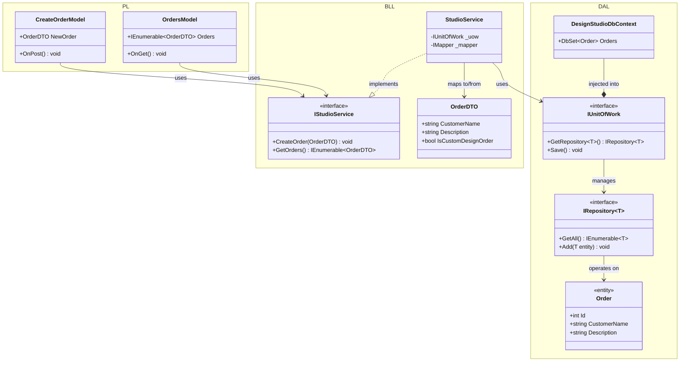

# Design Studio (Варіант 8)

Цей проєкт є реалізацією багаторівневої архітектури для управління студією дизайну. Система дозволяє переглядати портфоліо послуг, оформлювати замовлення на дизайн та переглядати список існуючих замовлень.

## 🏗 Архітектура проєкту
Проєкт побудований за принципом розділення на три основні рівні для забезпечення ізоляції логіки та доступу до даних:

1.  **PL (Presentation Layer)** — веб-інтерфейс на базі ASP.NET Core Razor Pages. Відповідає виключно за взаємодію з користувачем.
2.  **BLL (Business Logic Layer)** — рівень бізнес-логіки, де реалізовано основний функціона. Використовує **AutoMapper** для передачі даних через DTO (Data Transfer Objects).
3.  **DesignStudio.DAL (Data Access Layer)** — рівень доступу до даних за допомогою **Entity Framework Core (Code First)**. Реалізовано шаблони **Repository** (Generic) та **Unit of Work** для абстракції бази даних.

## 🛠 Технологічний стек
* **Мова:** C# (.NET 6/8).
* **БД:** SQLite (локальний файл `designstudio.db`).
* **ORM:** Entity Framework Core.
* **Мапінг:** AutoMapper.
* **Принципи:** SOLID, DRY, KISS, SoC.

## 🚀 Як запустити проєкт у Visual Studio

1.  **Відкриття рішення:**
    * Запустіть Visual Studio.
    * Оберіть **Open a project or solution** та виберіть файл `DesignStudioApp.sln`.
2.  **Налаштування запуску:**
    * У вікні **Solution Explorer** клацніть правою кнопкою миші на проект **DesignStudio.PL**.
    * Оберіть **Set as Startup Project**.
3.  **Відновлення пакетів:**
    * Visual Studio має автоматично завантажити NuGet пакети (EntityFrameworkCore.Sqlite, AutoMapper). Якщо цього не сталося, перейдіть у `Build -> Rebuild Solution`.
4.  **Запуск:**
    * Натисніть **F5** або зелену кнопку **Start** (IIS Express/DesignStudio.PL).
    * При першому запуску файл бази даних `designstudio.db` буде створено автоматично завдяки `Database.EnsureCreated()`.
5.  **Використання:**
    * На головній сторінці можна заповнити форму замовлення.
    * Перейдіть у вкладку **"Замовлення"** у верхньому меню, щоб побачити збережені дані.

---

### **UML Діаграма Класів**

### Пояснення до діаграми:
* **PL -> BLL:** Рівень представлення звертається тільки до інтерфейсу сервісу `IStudioService`.
* **BLL -> DAL:** Сервіси використовують `Unit of Work` для доступу до репозиторіїв та збереження змін.
* [=**DTO:** Об'єкт `OrderDTO` використовується для передачі даних між BLL та PL, щоб не відкривати сутності БД (`Order`) верхньому рівню.
* **Generic Repository:** Використовується один загальний репозиторій для всіх сутностей згідно з вимогами на "відмінно".